# MERN Stack Restaurant Reservation System 🍽️

This is a full-stack web application designed as a modern, single-page landing site for a restaurant, complete with a functional reservation form. The project is built using the MERN stack (MongoDB, Express.js, React.js, Node.js).

The frontend provides a visually appealing and responsive user interface, while the backend API handles the submission and storage of customer reservations.

## Table of Contents

-   [Demo Screenshots](#-demo---screenshots)
-   [Features](#-features)
-   [Tech Stack](#-tech-stack)
-   [Project Structure](#-project-structure)
-   [Getting Started](#-getting-started)
    -   [Prerequisites](#prerequisites)
    -   [Installation & Setup](#installation--setup)
    -   [Running the Application](#running-the-application)
-   [Contributing](#-contributing)
-   [License](#-license)

## 📸 Demo - Screenshots

Here is a comprehensive gallery of the application, showcasing the user journey from the landing page to form submission and final results.

| **1. Hero Section** | **2. About Us** | **3. Our Qualities** |
| :---: | :---: | :---: |
| 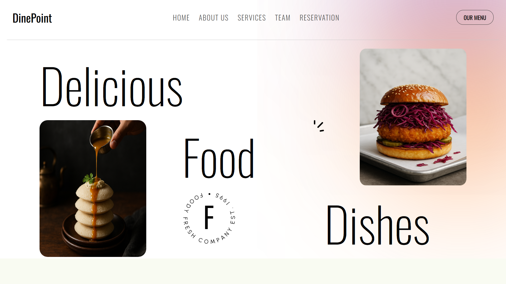 | 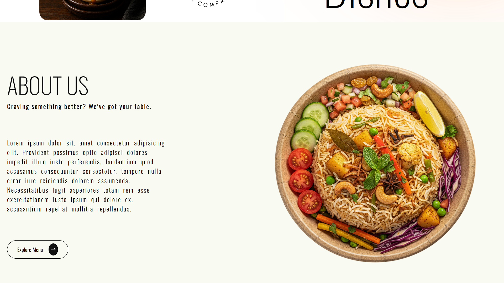 | 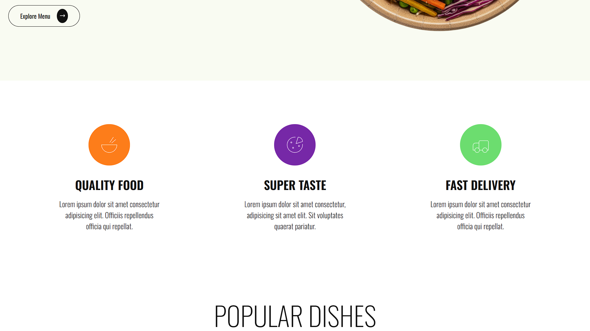 |
| **4. Popular Dishes** | **5. Key Stats** | **6. Our Team** |
| :---: | :---: | :---: |
| 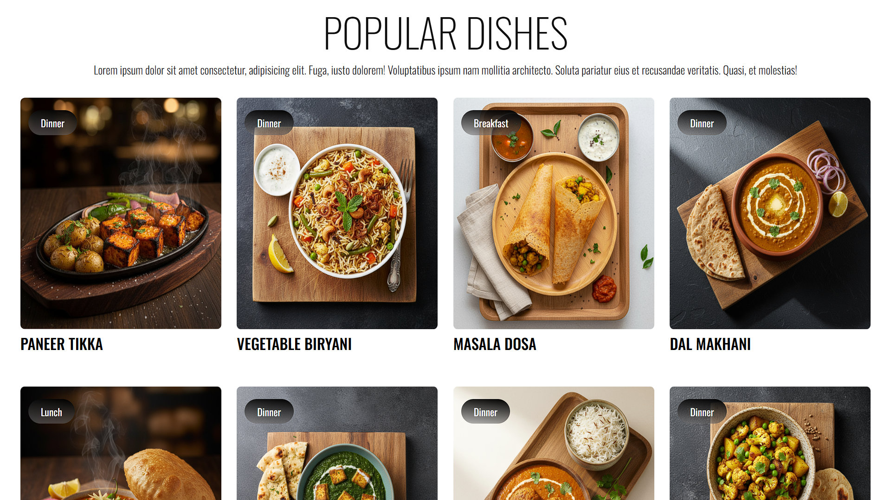 | 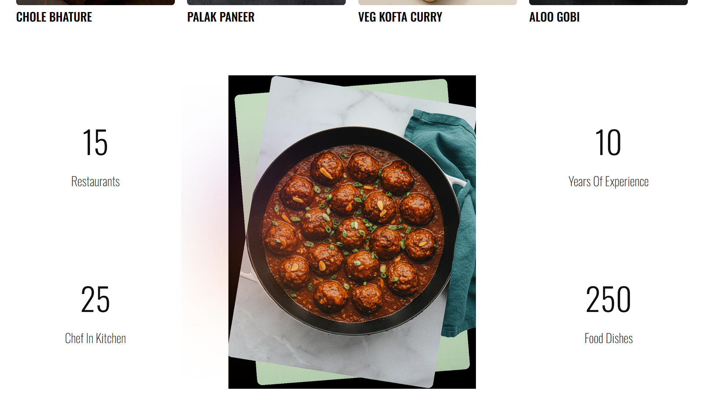 | 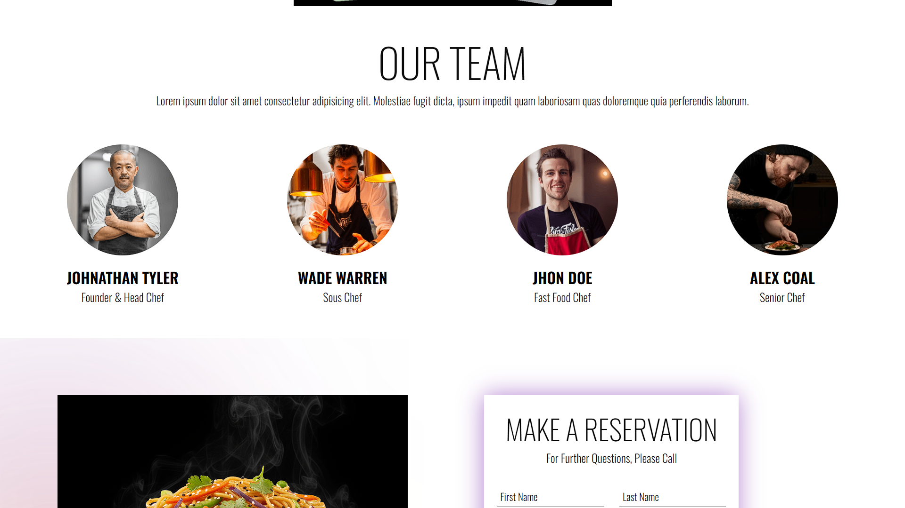 |
| **7. Reservation Form** | **8. Form Validation (Email)** | **9. Form Validation (Phone)** |
| :---: | :---: | :---: |
| 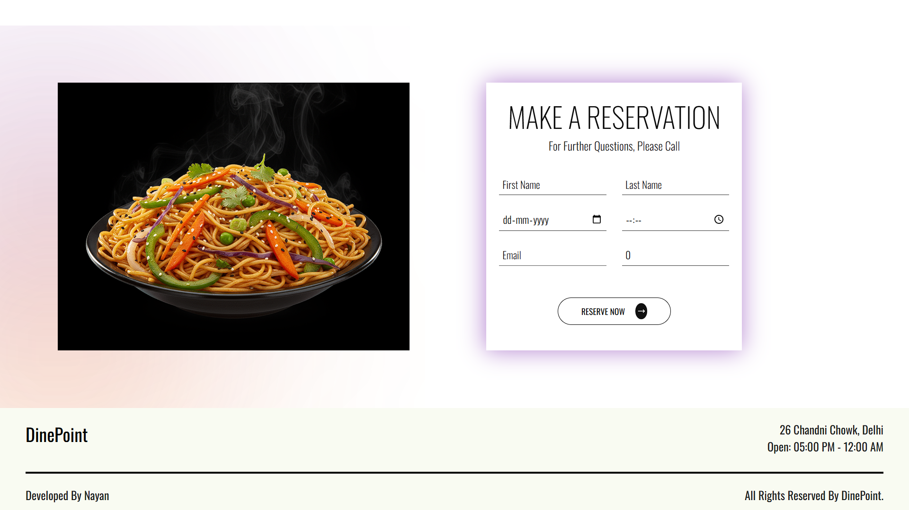 | 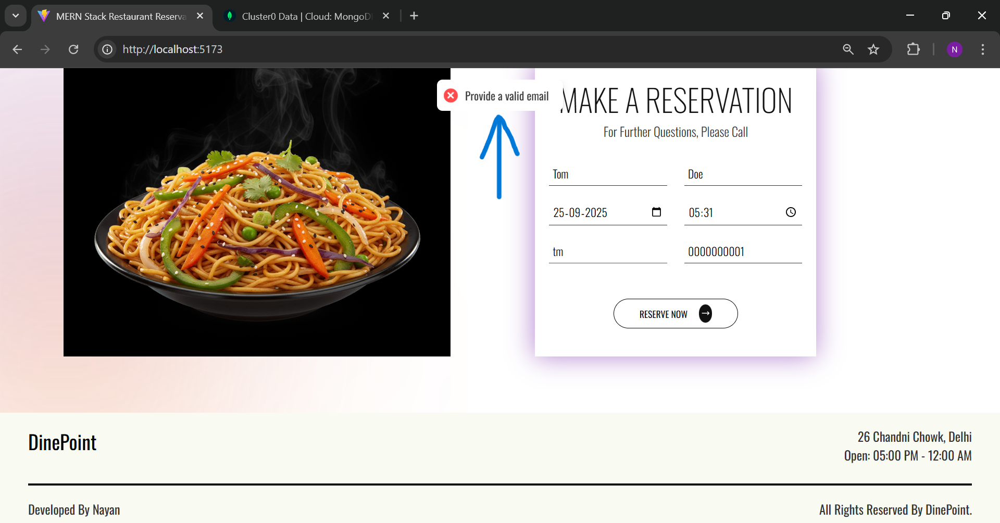 | 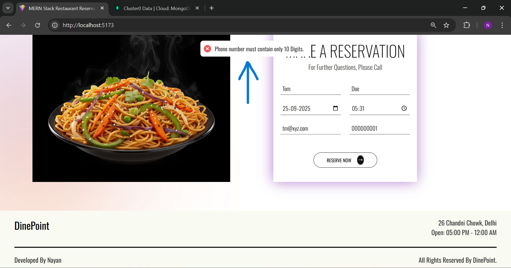 |
| **10. Success Message** | **11. Database Record** | **12. Not Found Page** |
| :---: | :---: | :---: |
| 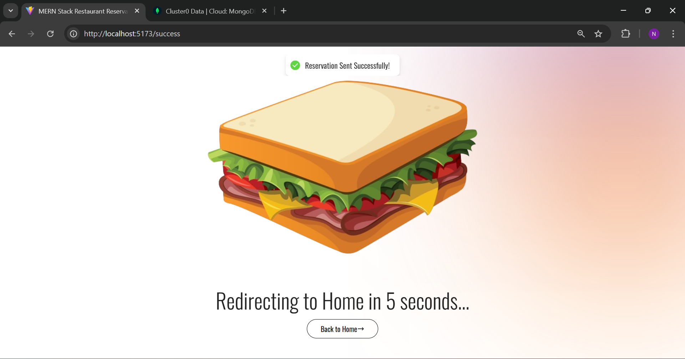 | 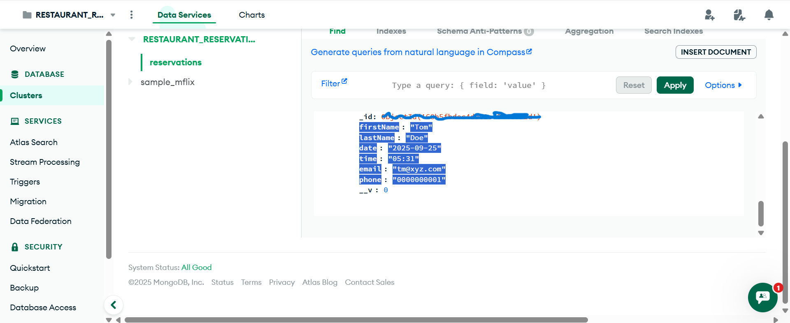 | 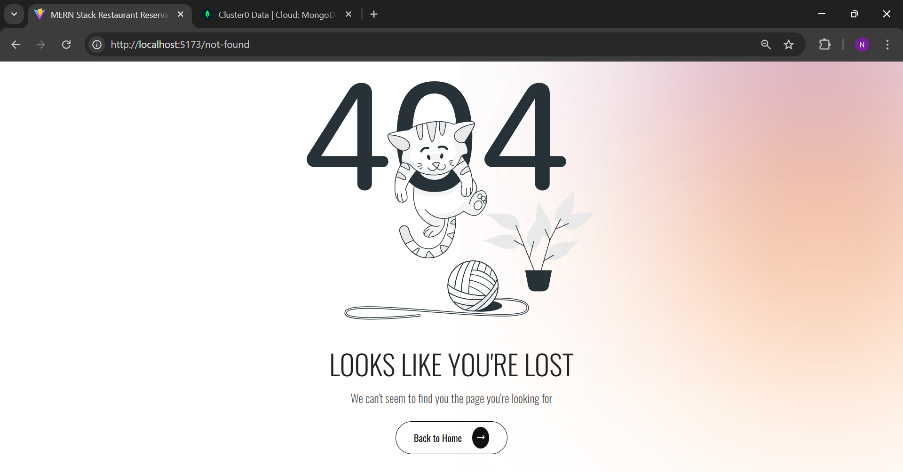 |

## ✨ Features

*   **Responsive Single-Page Design:** A modern landing page that is fully responsive and works across various devices.
*   **Reservation Form:** A clean and intuitive form for users to enter their details and request a table reservation.
*   **API for Reservations:** A backend endpoint that validates and saves reservation data submitted from the frontend.
*   **Direct Database Integration:** Reservation details are stored directly in a MongoDB database.
*   **User Feedback:** Utilizes toast notifications to provide immediate feedback to the user upon successful submission or in case of an error.
*   **Smooth Scrolling:** Implements smooth navigation between different sections of the single-page layout.

## 🛠️ Tech Stack

### Frontend
-   **React.js:** A JavaScript library for building the user interface.
-   **Vite:** A fast, modern frontend build tool.
-   **React Router DOM:** For handling client-side routing (e.g., to the success page).
-   **Axios:** A promise-based HTTP client for making API requests to the backend.
-   **React-Toastify:** For displaying toast notifications.
-   **React-Scroll & React-Icons:** For UI enhancements.

### Backend
-   **Node.js:** JavaScript runtime for the server.
-   **Express.js:** A web application framework for Node.js.
-   **MongoDB:** A NoSQL database used to store reservation data.
-   **Mongoose:** An Object Data Modeling (ODM) library for MongoDB.
-   **CORS:** Middleware to enable Cross-Origin Resource Sharing.
-   **Dotenv:** For managing environment variables.

## 📁 Project Structure

The repository is organized into two main folders:

-   `./frontend`: Contains the complete React.js client-side application.
-   `./backend`: Contains the Node.js and Express.js server-side application (API).

## 🚀 Getting Started

Follow these instructions to get a copy of the project up and running on your local machine for development and testing purposes.

### Prerequisites

Ensure you have the following installed on your system:
-   **Node.js** (v16.x or newer recommended)
-   **npm** (included with Node.js)
-   **Git**
-   **MongoDB:** A running instance of MongoDB. You can use a local installation or a cloud service like [MongoDB Atlas](https://www.mongodb.com/cloud/atlas/register) (free tier available).

### Installation & Setup

1.  **Clone the Repository**
    ```bash
    git clone https://github.com/jhaNayan2509/MERN_RESTAURANT_RESERVATION_APP.git
    cd MERN_RESTAURANT_RESERVATION_APP
    ```

2.  **Set Up the Backend**

    **2.1. Install Backend Dependencies**
    ```bash
    # Navigate into the backend directory
    cd backend

    # Install all required packages
    npm install
    ```
    > **Note:** This reads the `backend/package.json` file and automatically installs all necessary server dependencies like `express`, `mongoose`, `cors`, etc. You do not need to install them manually.

    **2.2. Configure Environment Variables**
    ```bash
    # Create a 'config' folder
    mkdir config

    # Create the environment file inside the 'config' folder
    touch config/config.env
    ```
    Now, open the `backend/config/config.env` file and add the following variables. **This file path is required by the code.**

    ```env
    MONGO_URI=mongodb+srv://<your-username>:<your-password>@yourcluster.mongodb.net/yourDatabaseName
    PORT=4000
    FRONTEND_URL=http://localhost:5173
    ```

3.  **Set Up the Frontend**
    ```bash
    # Navigate to the frontend directory from the project root
    cd ../frontend

    # Install all required packages
    npm install
    ```
    > **Note:** This reads the `frontend/package.json` file and installs all client-side dependencies like `react`, `react-dom`, `axios`, etc.

### Running the Application

This project requires two separate terminals to run both the backend server and the frontend client simultaneously.

**Terminal 1: Start the Backend Server**
```bash
# Navigate to the backend directory
cd backend

# Start the server in development mode
npm run dev
```
The backend API will now be running on `http://localhost:4000`.

**Terminal 2: Start the Frontend Application**
```bash
# Open a new terminal and navigate to the frontend directory
cd frontend

# Start the Vite development server
npm run dev
```
The frontend application will now be running on `http://localhost:5173`. Your browser should open to this address automatically.

> **💡 Pro Tip (for VS Code users):** You can easily manage both terminals by splitting your integrated terminal. Click the "Split Terminal" icon or use the shortcut `Ctrl+Shift+5`.

## 🤝 Contributing

Contributions are what make the open-source community such an amazing place to learn, inspire, and create. Any contributions you make are **greatly appreciated**.

1.  Fork the Project
2.  Create your Feature Branch (`git checkout -b feature/AmazingFeature`)
3.  Commit your Changes (`git commit -m 'Add some AmazingFeature'`)
4.  Push to the Branch (`git push origin feature/AmazingFeature`)
5.  Open a Pull Request

## 📜 License

Distributed under the MIT License. See `LICENSE` for more information.
